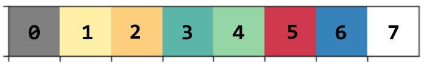

# Usage

---

**Requires Python 3 to run**.

```bash
usage: main.py [-h] -v VCF -c CHR -p PARENTAL [--version] [-z {HOM,HET}]
               [--conf KEY=VALUE [KEY=VALUE ...]]

Creates a haplotype plot from a VCF file.

optional arguments:
  -h, --help            show this help message and exit
  -v VCF, --vcf VCF     path to the input VCF file
  -c CHR, --chr CHR     chromosome to plot from the VCF
  -p PARENTAL, --parental PARENTAL
                        sample name from the VCF used as parental haplotype
  --version             show program's version number and exit
  -z {HOM,HET}, --zygosis {HOM,HET}
                        zygosis of the input VCF file
  --conf KEY=VALUE [KEY=VALUE ...]
                        set a number of key-value pairs to modify the default
                        plot configuration (do not put spaces before or after
                        the = sign). Possible values are: 'start=integer',
                        'end=integer'. If a value contains spaces, you should
                        define it with double quotes: foo="this is a
                        sentence".
```

For examples of use please go to the [documentation](/use_cases/).

---

# Color palette

The haplotype plot uses the following color palette to colour alleles:



The meaning of each colour is:

* 0 = Undetermined
* 1 = Allele inherited from first parental haplotype
* 2 = Allele inherited from second parental haplotype
* 3 = Reference allele, also carried by both parental haplotypes
* 4 = Non-reference allele, also carried by both parental haplotypes
* 5 = Non-parental allele
* 6 = Either or both parental alleles missing
* 7 = Missing allele
