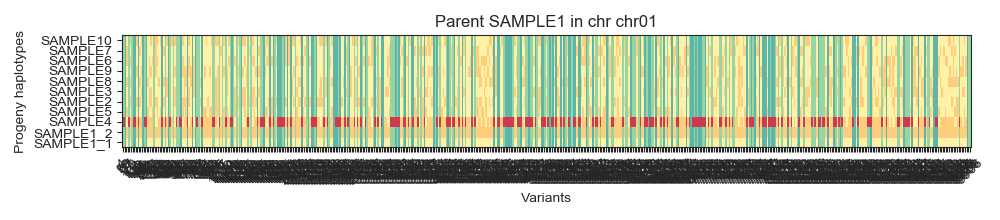
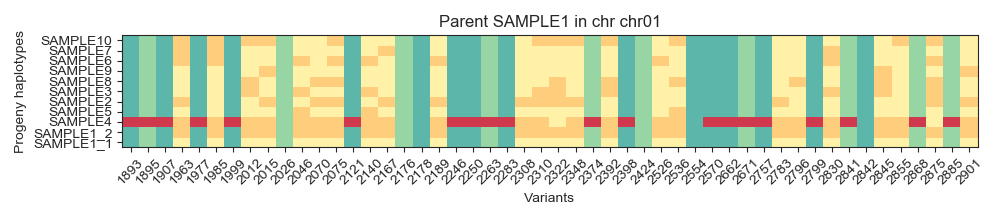
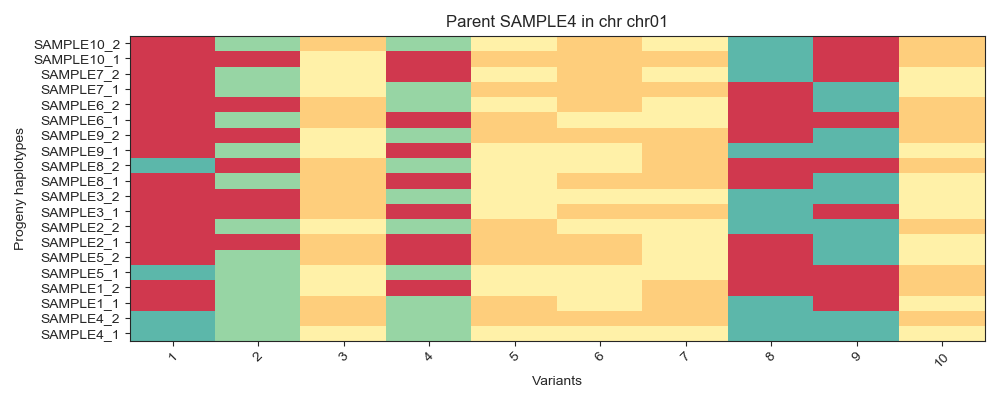
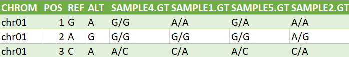
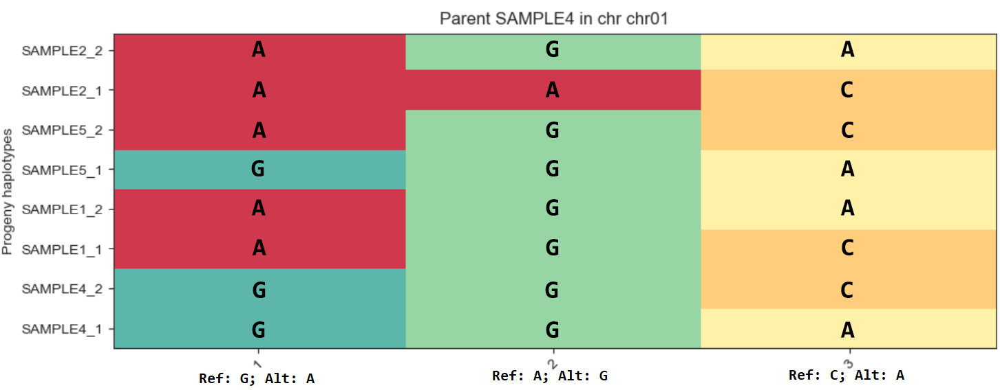

# Use cases

---

## Homozygous VCF

Plot the haplotypes of a VCF considering the following assumptions: their variants are homozygous (only one allele is considered in the plot), the chromosome of interest is `chr01` and the parental line being `SAMPLE1`.

**Parental line is always shown as the first element in the Y axis.**

```bash
python3 haplotype_plot/main.py -v "haplotype_plot/tests/data/chr01.vcf" -c "chr01" -p "SAMPLE1" -z HOM
```



Both alleles from parental `SAMPLE1` are distinguished via `_1` and `_2` postfixes.

By default, the haplotype plot is saved in the directory where the input data is, in this case `haplotype_plot/tests/data/`, with name `haplotypes.png`. You can override this behaviour by specifying an output file path via `-o` or `--output` arguments as in:

```bash
python3 haplotype_plot/main.py -v "haplotype_plot/tests/data/chr01.vcf" -c "chr01" -p "SAMPLE1" -z HOM -o "/path/to/plot.png"
```

## Homozygous VCF, X axis redimension

In the use case shown above we had **too many** variants in the X axis to display, right? We can redimension this axis via `start` and `end` configuration (`--conf`) arguments:

```bash
python3 haplotype_plot/main.py  -v "haplotype_plot/tests/data/chr01.vcf" -c "chr01" -p "SAMPLE1" -z HOM --conf start=100 end=150
```



The plot shows the 100th variant (1893) until the 150th one (2901).

## Heterozygous VCF

For heterozygous variants in the VCF both alleles are reported in the plot:

```bash
python3 haplotype_plot/main.py  -v "haplotype_plot/tests/data/chr01.vcf" -c "chr01" -p "SAMPLE4" -z HET --conf start=0 end=10
```



The first three variants in positions chr01:1, chr01:2 and chr01:3 represent the following genotype:



If we overexpose the VCF file with the plot on the three positions chr01:1, chr01:2 and chr01:3 and the first 4 samples (`SAMPLE4` (*parent*), `SAMPLE1`, `SAMPLE5` and `SAMPLE2`) we obtain the following:



The meaning of each colour is defined in the [color palette](/usage/?id=color-palette) section.

## Showing plot on screen

If you wish to see the haplotype plot via GUI instead of a plain `PNG` file, you must then override the default plot configuration through `--conf show=True` argument. For instance:

```bash
python3 haplotype_plot/main.py -v "haplotype_plot/tests/data/chr01.vcf" -c "chr01" -p "SAMPLE1" -z HOM --conf show=True
```

By default `show` is set to `False`.